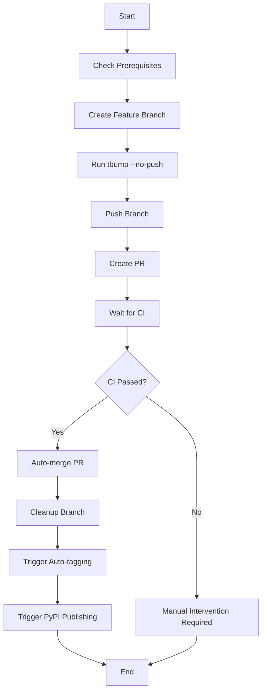

# Version Bump Automation Guide

This document explains the automated version bump system for EsXport.

## Overview

The automation system consists of:

1. **Bash Script** (`scripts/bump-version.sh`) - Handles the complete version bump workflow
2. **Auto-Tag Action** (`.github/workflows/auto-tag.yml`) - Creates tags when version changes
3. **PyPI Publish Action** (`.github/workflows/publish-pypi.yml`) - Publishes to PyPI on tag creation

## Quick Start

### One-Command Version Bump

```bash
./scripts/bump-version.sh 9.0.2
```

This single command will:
- ✅ Create a feature branch
- ✅ Update all version files using tbump
- ✅ Push the branch
- ✅ Create a PR to main
- ✅ Wait for CI to complete
- ✅ Auto-merge if all checks pass
- ✅ Trigger automatic tagging and PyPI publishing

## Prerequisites

### 1. Install GitHub CLI

```bash
# macOS
brew install gh

# Ubuntu/Debian
curl -fsSL https://cli.github.com/packages/githubcli-archive-keyring.gpg | sudo dd of=/usr/share/keyrings/githubcli-archive-keyring.gpg
sudo chmod go+r /usr/share/keyrings/githubcli-archive-keyring.gpg
echo "deb [arch=$(dpkg --print-architecture) signed-by=/usr/share/keyrings/githubcli-archive-keyring.gpg] https://cli.github.com/packages stable main" | sudo tee /etc/apt/sources.list.d/github-cli.list > /dev/null
sudo apt update
sudo apt install gh
```

### 2. Authenticate with GitHub

```bash
gh auth login
```

### 3. Configure PyPI Publishing (One-time setup)

#### Option A: Trusted Publisher (Recommended)

1. Go to [PyPI Trusted Publishers](https://pypi.org/manage/account/publishing/)
2. Add a new publisher with:
   - **PyPI Project Name**: `esxport`
   - **Owner**: `nikhilbadyal`
   - **Repository name**: `esxport`
   - **Workflow filename**: `publish-pypi.yml`
   - **Environment name**: Leave empty

#### Option B: API Token (Alternative)

1. Generate PyPI API token
2. Add as GitHub secret: `Settings > Secrets > Actions > PYPI_API_TOKEN`

## Workflow Details

### 1. Version Bump Script

The `scripts/bump-version.sh` script performs these steps:



### 2. Auto-Tagging Workflow

Triggers when:
- Push to main branch
- Commit message contains "⬆️ Bump to"
- Files changed: `esxport/__init__.py` or `pyproject.toml`

Actions:
- Creates Git tag (e.g., `v9.0.2`)
- Creates GitHub Release with changelog

### 3. PyPI Publishing Workflow

Triggers when:
- New tag is pushed
- GitHub release is published

Actions:
- Runs full test suite
- Builds wheel and source distribution
- Publishes to PyPI using trusted publishing
- Updates GitHub release with build artifacts

## Usage Examples

### Standard Version Bump

```bash
./scripts/bump-version.sh 9.0.2
```

### Pre-release Version

```bash
./scripts/bump-version.sh 9.1.0rc1
```

### Monitoring Progress

The script provides colored output:
- 🔵 **Info**: General information
- ✅ **Success**: Completed steps
- ⚠️ **Warning**: Non-critical issues
- ❌ **Error**: Failures requiring attention

## Troubleshooting

### Script Fails at PR Creation

**Issue**: GitHub CLI not authenticated or insufficient permissions

**Solution**:
```bash
gh auth status
gh auth login --scopes repo
```

### CI Checks Fail

**Issue**: Tests fail due to Elasticsearch compatibility

**Solution**:
1. Script will stop and provide PR URL
2. Review failing tests manually
3. Fix compatibility issues in the PR
4. Once fixed, merge the PR manually

### PyPI Publishing Fails

**Issue**: Authentication or package validation errors

**Solutions**:
- Check PyPI trusted publisher configuration
- Verify package builds locally: `python -m build`
- Check for duplicate version: versions must be unique

### Manual Rollback

If something goes wrong:

```bash
# Delete local branch
git branch -D upgrade/elasticsearch-X.X.X

# Delete remote branch
git push origin --delete upgrade/elasticsearch-X.X.X

# Delete tag (if created)
git tag -d vX.X.X
git push origin --delete vX.X.X
```

## Configuration

### Customizing tbump

Edit `pyproject.toml` to modify tbump behavior:

```toml
[tool.tbump.git]
message_template = "🚀 Release {new_version}"  # Custom commit message
tag_template = "release-{new_version}"         # Custom tag format
```

### Customizing GitHub Actions

1. **Auto-tag timing**: Edit `.github/workflows/auto-tag.yml` triggers
2. **PyPI environment**: Modify the publishing workflow for different PyPI instances
3. **Test matrix**: Adjust Python versions in the publishing workflow

## Security Considerations

- ✅ Uses GitHub's trusted publishing for PyPI (no API keys stored)
- ✅ Minimal required permissions
- ✅ Automatic cleanup of temporary branches
- ✅ All operations are auditable through GitHub Actions logs

## Integration with Existing Workflow

This automation works alongside your existing:
- Pre-commit hooks (run by tbump)
- CI tests (verified before merge)
- Code review process (PR-based)
- Branch protection rules

## Best Practices

1. **Always test locally first**: Run tests before version bump
2. **Keep changes minimal**: Only version-related changes in bump PRs
3. **Monitor CI**: Check that all tests pass with new Elasticsearch version
4. **Review releases**: Verify PyPI publication and GitHub releases
5. **Coordinate with team**: Announce version bumps in team channels

---

## Support

For issues with the automation:
1. Check GitHub Actions logs
2. Review script output
3. Open an issue with error details
4. Tag @nikhilbadyal for urgent issues
